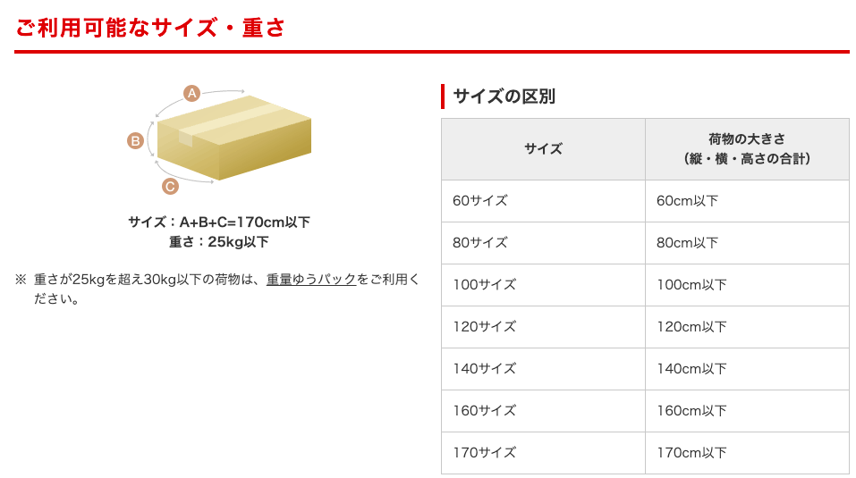

# 事務関連マニュアル
## 休日出勤
**前日の昼**  までに上長と相談の上、個別に申請します。
## 経費精算
主な項目は次の通りです

- 資料代
- 通信費
- 消耗品代

表の形にするとこうなります

| 摘要 | 内容
| -- | --
| 資料代 | 書籍 本 有料アプリ
| 通信費 | 切手 宅配便
| 消耗品費 | 文具 台所用品

## 宅配便発送

## プリンタ
## 大容量データ
## 電話、来客対応について
## ゴミ収集について
## その他

## ほかに追加することあるかな？

! をつけないとハイパーリンクになります
[日経新聞](https://www.nikkei.com)

